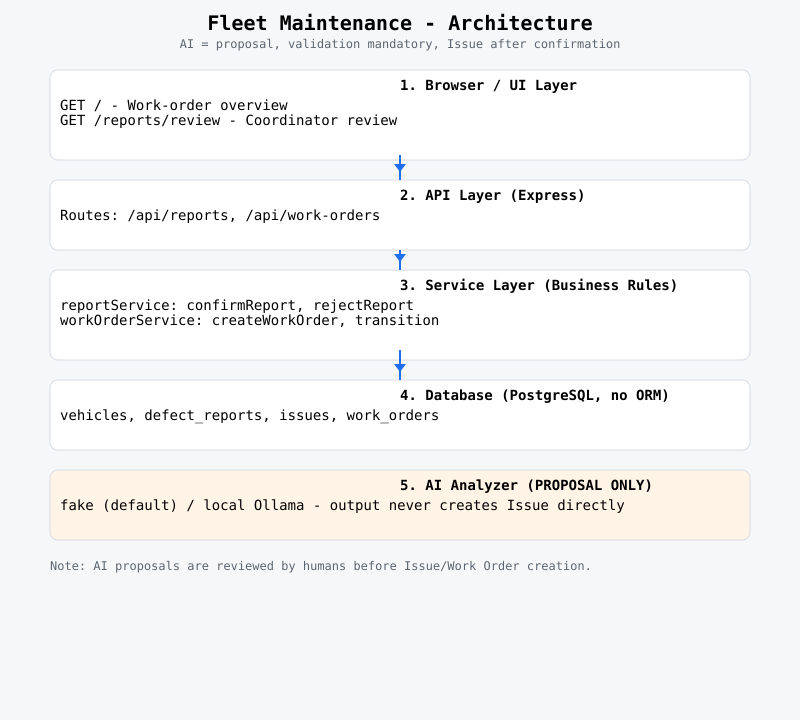

# FleetMaintenance

## Problem

Fleet vehicles generate maintenance defects daily — a spongy brake pedal, a warning light, a strange engine noise. In many small-to-mid-size fleets, these reports arrive as unstructured text (email, chat, verbal) and must be manually triaged by a coordinator who decides: *What category is this? How severe is it? Does it need a work order?*

This manual triage is repetitive, inconsistent, and slow. The same keywords appear across dozens of reports, yet each one is read and classified from scratch. Meanwhile, confirmed issues must be tracked through a maintenance lifecycle (created → in progress → completed/cancelled) with clear status transitions — skipping a step or allowing an invalid jump creates operational confusion.

## Why This Exists

This project is a reference prototype built to demonstrate three engineering concerns in a concrete, inspectable product:

- **Workflow modelling** — Representing a real-world maintenance process (report → proposal → confirmation → issue → work order → lifecycle) as an explicit, enforceable state machine rather than implicit application behavior.
- **Controlled AI integration** — Using AI as a proposal generator with mandatory human validation, contract-enforced output, and clear failure handling — never as an autonomous decision-maker.
- **Clear responsibility separation** — Distinct layers for routing, business logic, data access, and AI analysis, with explicit boundaries (e.g., the analyzer receives only raw text; the service layer owns all status transitions).

> **Note:** This is a finished reference project. It documents my first implementation steps using AI-assisted product development and does not reflect my current way of working. It serves as a snapshot of early exploration, not a statement of present-day practice.

## User

**Fleet maintenance coordinators** — the person (or small team) responsible for:
- Receiving defect reports from drivers or technicians
- Deciding which reports become actionable issues
- Creating and tracking work orders through completion

The product serves a single coordinator role: review AI-assisted proposals, confirm or reject them, and manage the resulting work orders. There are no multi-role permissions, no authentication, and no pagination — the scope is intentionally small.

## Core Workflow

```text
User reports vehicle problem
      ↓
AI analyzes report
      ↓
AI produces structured proposal
      ↓
Human reviews / edits / confirms
      ↓
Confirmed Issue
      ↓
Work Order
      ↓
Maintenance lifecycle
```

**Key boundaries:**
- **AI output is a PROPOSAL** — never an Issue directly; the coordinator must confirm before an Issue exists
- **Human confirmation is mandatory** — the application never auto-creates Issues from AI analysis
- **Status transitions are validated** in the service layer; the generic transition endpoint enforces business rules
- **No React, no auth, no pagination** — vanilla JS + EJS + plain CSS; no build step

## Current Product State

### What's Built

All planned milestones (M0–M5) are complete:

| Milestone | Outcome |
|-----------|---------|
| **M0 — Foundation** | Local application skeleton and development infrastructure |
| **M1 — Manual Workflow** | Report → confirmation → issue → work order lifecycle without AI |
| **M2 — AI-Assisted Workflow** | AI-backed report analysis behind a provider-agnostic contract |
| **M3 — Coordinator Review UI** | Browser-based review and confirmation workflow |
| **M4 — Work-Order UI** | Browser-based work-order management |
| **M5 — Portfolio Polish** | Documentation, architecture record, tests, demo data, and final cleanup |

### Technology Stack

| Layer | Technology |
|-------|-----------|
| **Application** | Node.js (LTS), Express, EJS, vanilla JS + `fetch()`, plain CSS |
| **Database** | PostgreSQL, `pg` / node-postgres, raw parameterized SQL, no ORM |
| **AI Analyzer** | Fake analyzer (deterministic) or local Ollama; contract-validated proposals only |
| **Testing** | 28 unit tests using fake db + fake analyzer; no live model required |
| **Deployment** | Docker Compose for local development; no production deployment scripts |

### Quick Start

#### Deterministic Core (No LLM Required)

The application can be run and tested **without Ollama or any local LLM** — the fake analyzer provides deterministic category/severity/summary suggestions for development and testing.

```bash
# 1. Install dependencies
npm install

# 2. Set up the database (PostgreSQL required)
npm run db:setup

# 3. Start the application
npm start

# 4. Visit http://localhost:3000
# 5. Run the test suite
npm test   # 28/28 passing
```

### With Local LLM (Optional)

If you have Ollama running with a compatible model (e.g., `qwen3:30b-a3b`):

```bash
export AI_PROVIDER=local
npm start
```

The same application code works with both the fake analyzer and a local LLM — the provider is configured via `.env`.

---

## Product Visualization


---

## Central Product Principles

These principles define the product's boundaries and are enforced in the application architecture:

1. **AI output is a PROPOSAL — never an Issue directly.** The analyzer's output is persisted as `ai_suggested_*` on a defect report row. The coordinator must explicitly confirm before an Issue can exist. The application never auto-creates Issues from AI analysis.

2. **Human confirmation is mandatory.** The `confirmReport` service validates `category`, `severity`, `summary`, and `confirmedByName` before creating an Issue. No confirmation, no Issue.

3. **Status transitions are validated business rules.** The generic `POST /api/work-orders/:id/transition` endpoint enforces allowed transitions: `created → [in_progress, cancelled]`, `in_progress → [completed, cancelled]`. Terminal states (`completed`, `cancelled`) accept no further transitions.

4. **No ORM — raw, auditable SQL.** All database access uses parameterized SQL via `pg`. Queries are explicit, reviewable, and not abstracted behind an ORM.

5. **Deliberately simple stack.** No React, no auth, no pagination, no build step. Server-rendered EJS with vanilla JavaScript and plain CSS. The goal is a presentable reference prototype, not a production-scale product.

## Links for Further Documentation

### Architecture & Design



- [Architecture Overview](docs/architecture.md) — Component boundaries, data flow diagrams, database schema, human-in-the-loop boundary
- [Engineering Log](fleet-maintenance-engineering-log.md) — Living document capturing product, architecture, and implementation decisions
- [Technical Decisions (ADRs)](fleet-maintenance-engineering-log.md#14-technical-decisions-adrs) — 7 architectural decision records:
  - **ADR-001:** Deliberately simple MVP stack
  - **ADR-002:** Separate AI proposals from human-confirmed issues
  - **ADR-003:** Provider-agnostic analyzer contract
  - **ADR-004:** Human confirmation required before creating Issues
  - **ADR-005:** Local LLM deployment and model selection
  - **ADR-006:** Structured-output validation and AI failure handling
  - **ADR-007:** Local LLM security boundary and LAN-only deployment

### Testing
- [Testing Documentation](docs/testing.md) — Test files, patterns (fake DB/analyzer), running instructions, coverage gaps
- **28 automated tests** covering:
  - `tests/reportService.test.js` — Defect report workflow (manual & AI submissions, confirmation, rejection)
  - `tests/workOrderService.test.js` — Work-order creation, status transitions, valid/invalid jumps
  - `tests/localAnalyzer.test.js` — Fake analyzer: deterministic mapping, contract validation, error handling

### Demo & Usage
- [Demo Walkthrough](docs/demo-walkthrough.md) — End-to-end scenario showing the complete workflow

### API Reference

| Method | Path | Description |
|--------|------|-------------|
| `GET` | `/` | Work-order overview page (eligible open issues) |
| `POST` | `/api/reports` | Create a manual defect report |
| `POST` | `/api/reports/ai` | Create an AI-assisted defect report (proposal only) |
| `POST` | `/api/reports/:id/confirm` | Confirm a report as an Issue (creates Issue + transitions status) |
| `POST` | `/api/reports/:id/reject` | Mark a report as rejected |
| `GET` | `/api/reports/pending` | List pending defect reports (for coordinator review) |
| `POST` | `/api/work-orders` | Create a work order from an open Issue |
| `POST` | `/api/work-orders/:id/transition` | Transition a work order to a new status |
| `GET` | `/api/health` | Health check endpoint |

### Project Structure

```text
src/              # Application source
  app.js          # Express app factory
  config.js       # Environment configuration
  routes/         # API + browser routes
  services/       # Business logic (no duplication of API endpoints)
  db/             # Database access (raw parameterized SQL)

views/            # EJS templates
  reports/        # Coordinator review UI
  work-orders/    # Work-order overview

public/           # Static assets (CSS, JS)
  css/            # Plain CSS styles
  js/             # Vanilla JavaScript

tests/            # Unit tests (fake db, mock analyzer)

db/               # Database schema, seed, and setup script
docs/             # Architecture, testing, and demo documentation
```

---

## License

This project is licensed under the MIT License. See [LICENSE](LICENSE) for the full text.

---

*Last updated: 2026-09-07*
